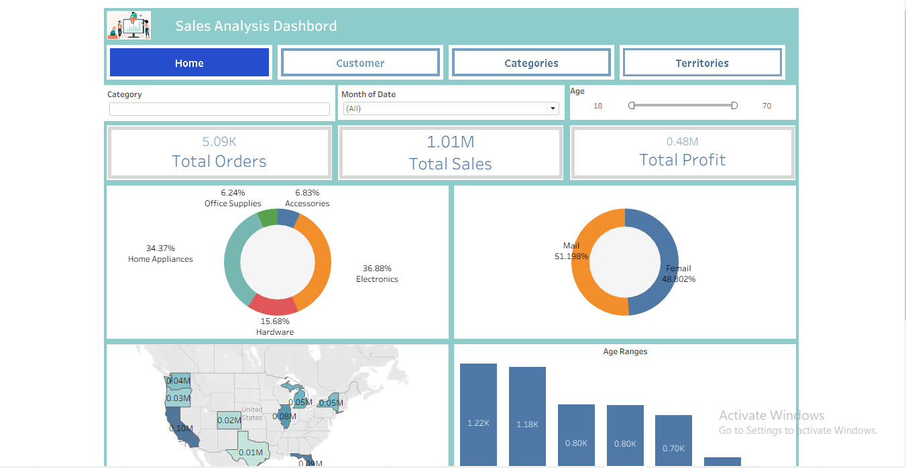
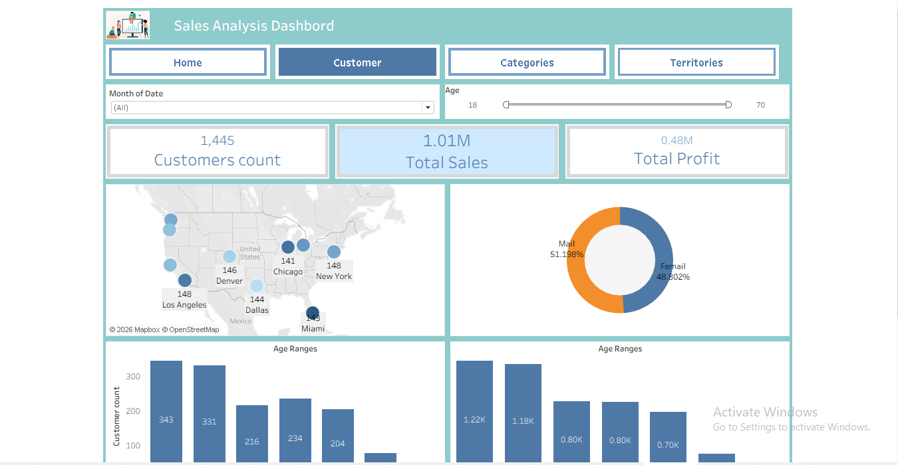
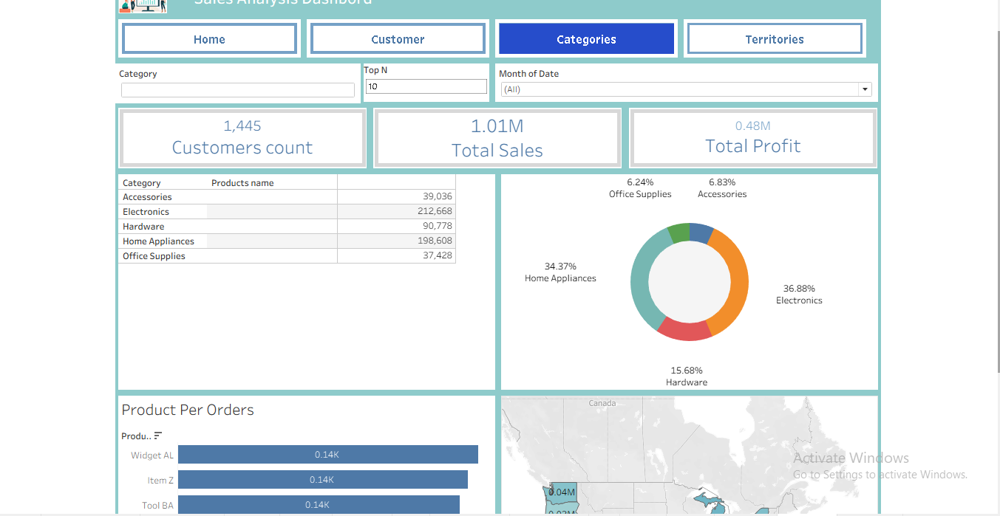
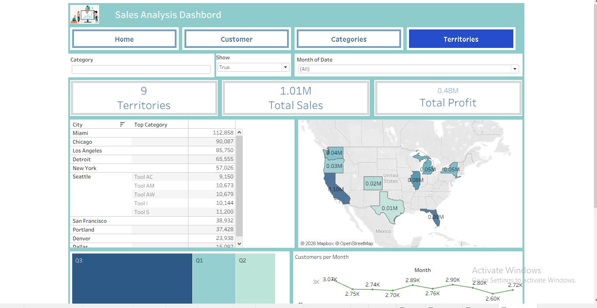

# 📊 Sales Analysis Dashboard (Tableau)

## 📌 Overview

An interactive **Sales Analysis Dashboard** built with Tableau to analyze:

* Sales performance
* Customer insights
* Product categories
* Geographic distribution

---

## 📁 Project Structure

Make sure your repo looks like this:

```
project-root/
│── assets/
│   ├── apl1.png
│   ├── apl2.png
│   ├── apl3.png
│   ├── apl4.png
│
│── Sales pro.twbx
│── README.md
```

---

## 🖼️ Dashboards Preview

### 🏠 Home Dashboard



---

### 👥 Customer Dashboard



---

### 📦 Categories Dashboard



---

### 🌍 Territories Dashboard



---

## 🚀 Features

* KPI Cards (Sales, Profit, Orders, Customers)
* Interactive filters (Category, Month, Age)
* Geo-map visualization
* Customer segmentation
* Product performance analysis

---

## 📊 Key Metrics

* **Total Sales:** 1.01M
* **Total Profit:** 0.48M
* **Total Orders:** 5.09K
* **Customers:** 1,445

---

## 🛠️ Tools Used

* Tableau
* Excel

---

## ⚙️ How to Use

1. Download `Sales pro.twbx`
2. Open in Tableau Desktop
3. Explore dashboards using filters and navigation tabs

---

